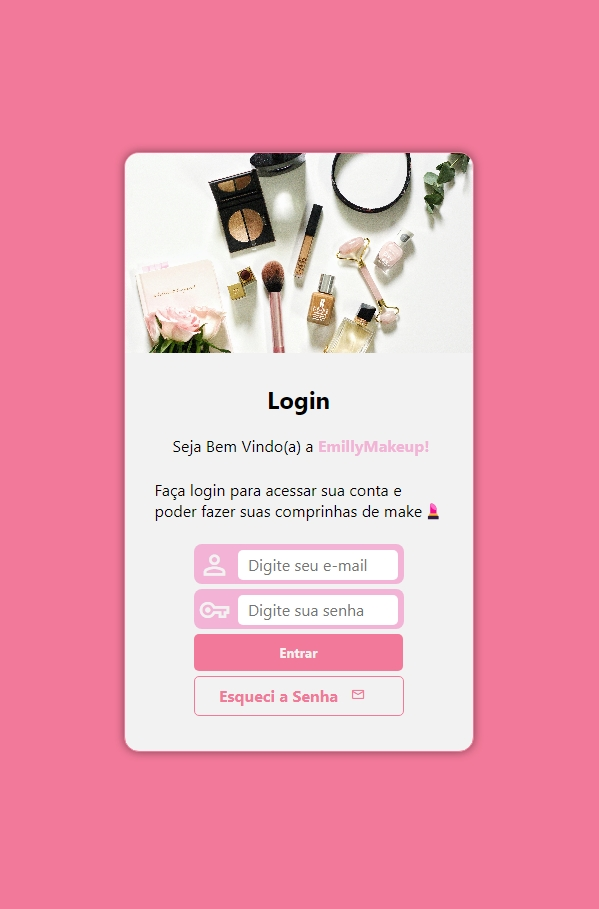
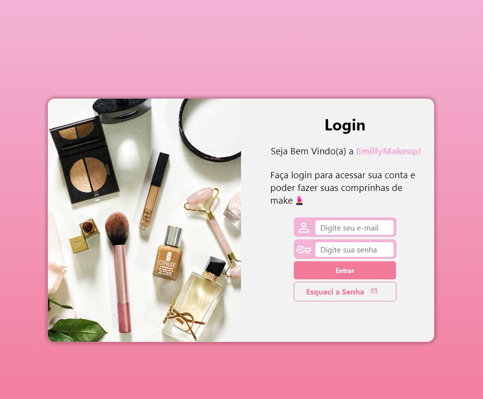
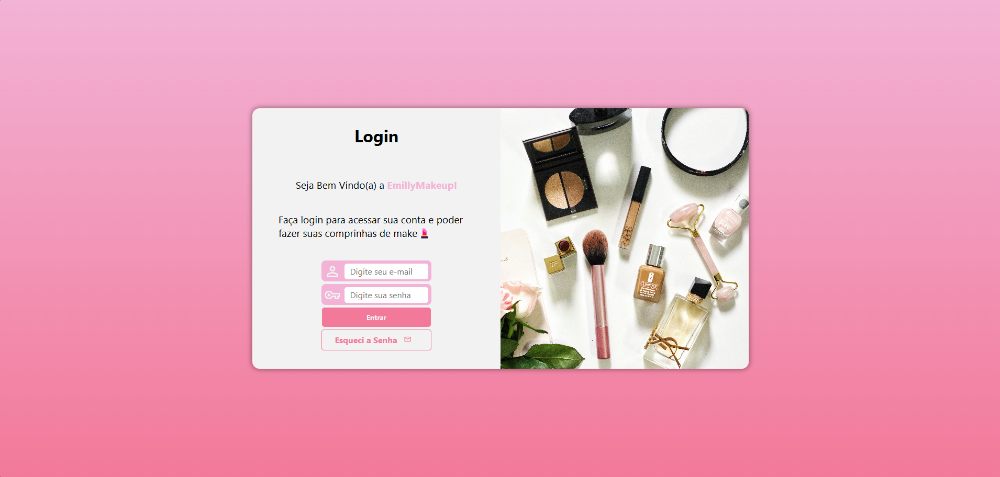

# Projeto Login - EmillyMakeup 💄
 Projeto Login desenvolvido e inspirado no curso de HTML5 e CSS3 Módulo 4 do Professor Gustavo Guanabara
 
 Link: https://emillymoitinho.github.io/project_login/

## 📱 Projeto Responsivo

O projeto inclui um formulário de login que se adapta automaticamente a diferentes tamanhos de tela. Isso garante que os usuários tenham uma experiência consistente, seja em dispositivos móveis (celulares e tablets) ou em telas maiores (computadores e TVs).

## 🚀 Tecnologias Utilizadas

- **HTML5**: Estruturação semântica do conteúdo.
- **CSS3**: Estilização e responsividade utilizando Media Queries.

 ## 📸 Fotos do Projeto 
 
 * Projeto em Dispositivos Móveis 
   
   

* Projeto em Dipostivos Móveis Maiores

   

* Projeto em Telas Grandes (Computador, TVs)

  

